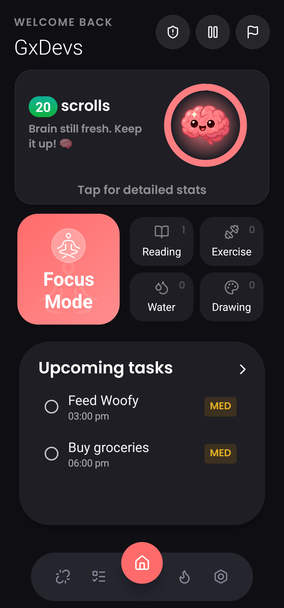
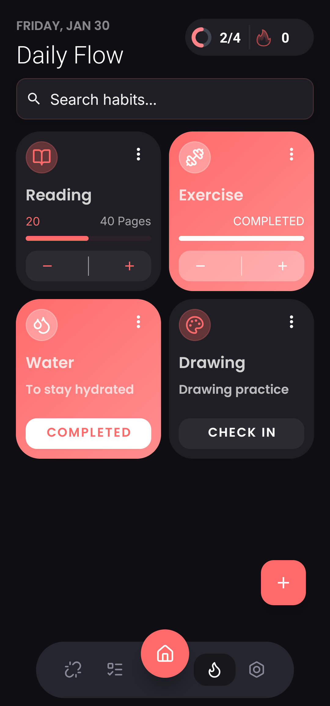
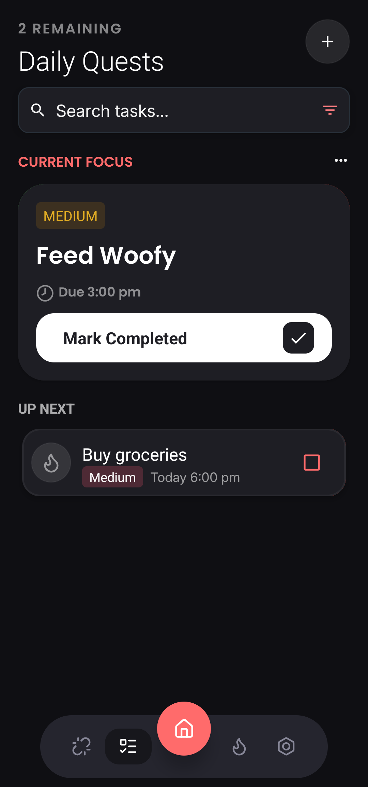
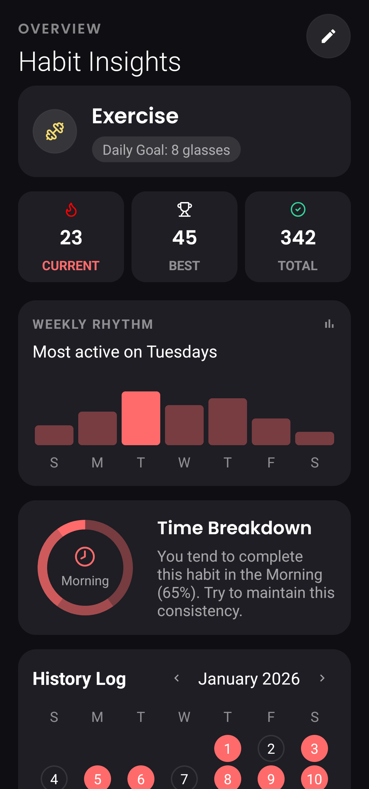
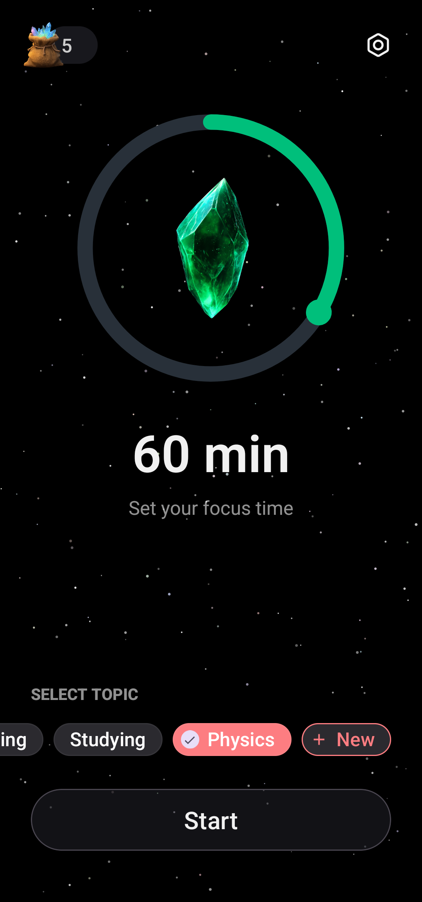
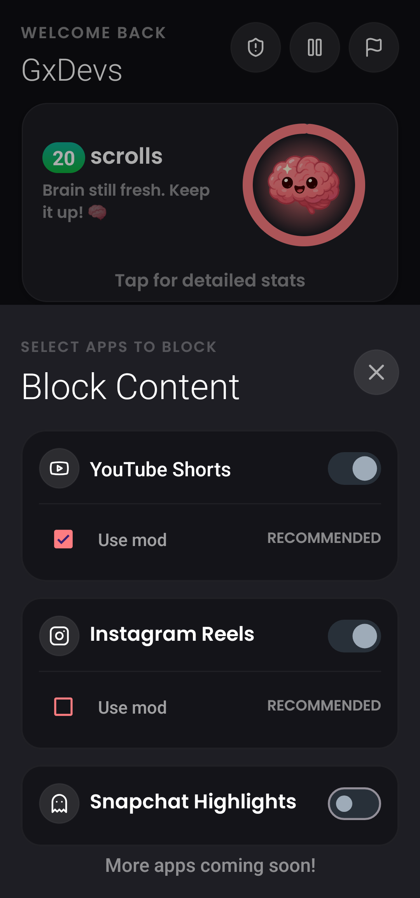
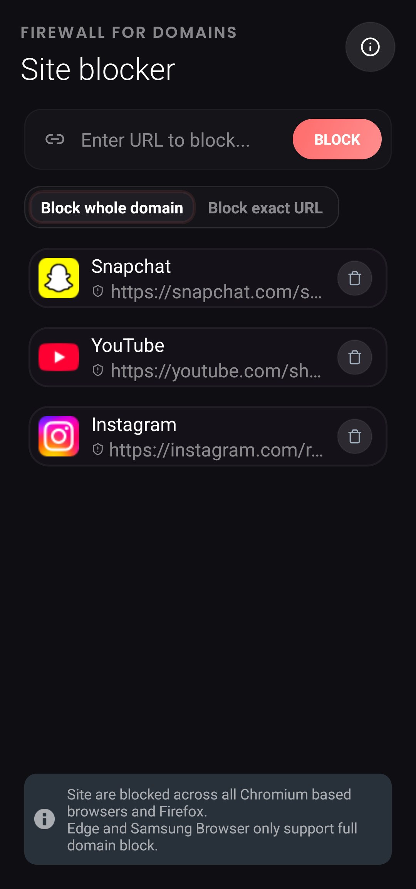
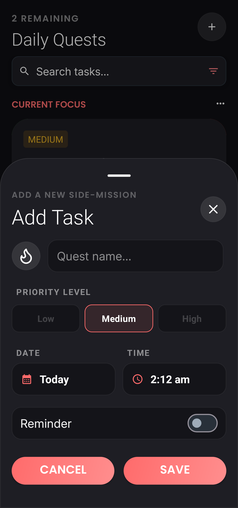
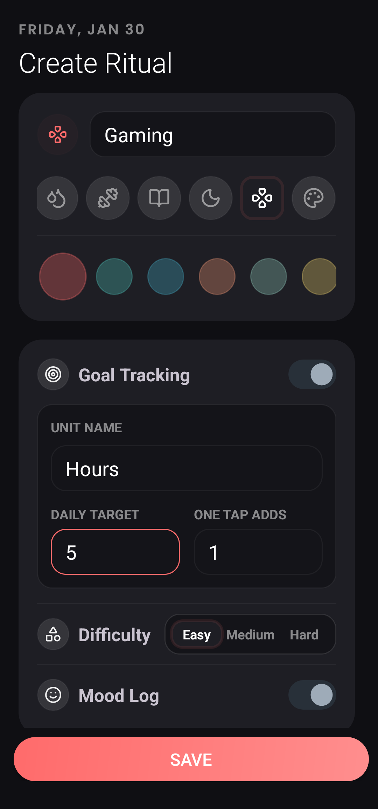
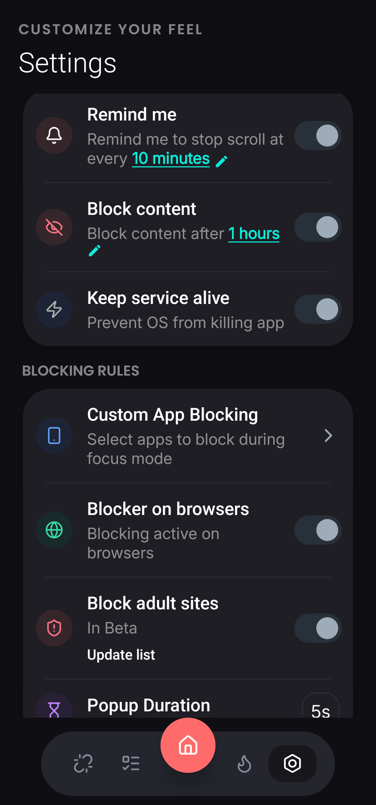

<div align="center">

  

# Mind Mint

**Reclaim Your Focus. Master Your Time.**

  <p>
    <a href="https://github.com/gtxPrime/Mind-Mint/stargazers">
      
    </a>
    <a href="https://github.com/gtxPrime/Mind-Mint/network/members">
      
    </a>
    <a href="https://github.com/gtxPrime/Mind-Mint/issues">
      
    </a>
    <a href="https://github.com/gtxPrime/Mind-Mint/blob/main/LICENSE">
      
    </a>
     <a href="#">
      
    </a>
  </p>

  <h3>
    <a href="#-features">Features</a>
    <span> | </span>
    <a href="#-tech-stack">Tech Stack</a>
    <span> | </span>
    <a href="#-installation">Installation</a>
    <span> | </span>
    <a href="#-contributing">Contributing</a>
  </h3>
</div>

---

<br />

## 📱 About Mind Mint

**Mind Mint** is not just an app blocker; it's a comprehensive productivity ecosystem designed to help you break free from the doomscrolling cycle. By combining powerful blocking tools with gamification and detailed analytics, Mind Mint turns the difficult task of staying focused into a rewarding experience.

> "Productivity is not about doing more. It's about doing what matters."

---

## <a id="-features"></a>🚀 Features

Mind Mint comes packed with powerful features designed to help you stay on track.

### 🧘 **Immersive Focus Mode**

Transform your productivity sessions into a visual journey.

- **Crystal Progression**: Watch your "Focus Crystal" grow and evolve as you complete your sessions. The longer you focus, the rarer the crystal acts as a visual reward (Ruby, Emerald, Amethyst, and more).
- **Pomodoro Support**: Built-in support for the Pomodoro technique with customizable work/break intervals.
- **Nebula Ambience**: A calming, animated starfield background helps you enter a flow state.
- **Tagging**: Categorize your sessions (Study, Work, Reading) to track where your time goes.

### 🚫 **Intelligent App Blocker**

Stop doomscrolling before it starts.

- **Strict Blocking**: Instantly block distracting apps like Instagram, YouTube Shorts, and TikTok.
- **Overlay Shield**: A non-intrusive but firm overlay prevents you from accessing blocked apps during focus hours.
- **Usage Limits**: Set daily time allowances for specific apps. Once the time is up, the app is locked for the day.

### 💰 **Gamification & Rewards**

Make productivity addictive in a good way.

- **Mint Crystals**: Earn in-app currency for every minute of successful focus.
- **Shop**: (Coming Soon) Use your hard-earned Mint Crystals to unlock new themes, crystal styles, and companions.
- **Streaks**: Keep your daily streak alive to earn bonus multipliers.

### 📊 **Deep Analytics**

Understand your habits with data.

- **Habit Heatmaps**: GitHub-style activity heatmaps showing your consistency over the year.
- **Usage Charts**: Detailed bar and pie charts breaking down your app usage and focus time.
- **Insights**: Get weekly reports on your most productive days and biggest distractions.

### ✅ **Integrated Task Manager**

- **Quick Add**: Rapidly add tasks directly from the home screen.
- **Date & Priority**: Organize your to-dos with due dates and priority levels.
- **Widget Support**: View and check off tasks directly from your home screen widget.

<br />

## <a id="-screenshots"></a>📸 Screenshots

<div align="center">
  
  
  
  
  
  <br/>
  <br/>
  
  
  
  
  
</div>

---

## <a id="-tech-stack"></a>🛠 Tech Stack

Mind Mint is built with modern Android development practices, ensuring a smooth and responsive experience.

<div align="center">

| Category             | Technologies                                                                                                                                                                                                                                                           |
| :------------------- | :--------------------------------------------------------------------------------------------------------------------------------------------------------------------------------------------------------------------------------------------------------------------- |
| **Languages**        |    |
| **Architecture**     | **MVVM** (Model-View-ViewModel)                                                                                                                                                                                                                                        |
| **Database**         | **Room** (SQLite ORM)                                                                                                                                                                                                                                                  |
| **Networking**       | **OkHttp**, **Glide** (Image Loading)                                                                                                                                                                                                                                  |
| **UI Components**    | **Jetpack Compose**, **Material Design 3**, **MPAndroidChart**, **Lottie**                                                                                                                                                                                             |
| **Backend/Services** | **Firebase** (Crashlytics, FCM)                                                                                                                                                                                                                                        |
| **Tools**            | **Gradle**, **Android Studio**                                                                                                                                                                                                                                         |

</div>

<details>
<summary>Click to see full dependency list</summary>

- `androidx.core:core-ktx`
- `androidx.appcompat:appcompat`
- `com.google.android.material:material`
- `com.github.PhilJay:MPAndroidChart`
- `com.airbnb.android:lottie`
- `com.github.skydoves:balloon`
- `com.github.bumptech.glide:glide`
- `androidx.room:room-runtime`
- `me.tankery.lib:circularSeekBar`
- And more... (see `build.gradle`)

</details>

---

## 📈 Repository Stats

<div align="center">

|                                               **Commit Activity**                                               |                                           **Repo Size**                                            |
| :-------------------------------------------------------------------------------------------------------------: | :------------------------------------------------------------------------------------------------: |
|  |  |

|                                                 **Top Language**                                                 |                                                    **Code Size**                                                    |
| :--------------------------------------------------------------------------------------------------------------: | :-----------------------------------------------------------------------------------------------------------------: |
|  |  |

</div>

---

## 🗺 Roadmap

We are constantly improving Mind Mint. Here is what's coming next:

- [ ] **Companions**: AI-driven friendly companions to motivate you.
- [ ] **Battles**: Challenge friends to focus streaks.
- [ ] **Cloud Sync**: Backup your data across devices.
- [ ] **Web Dashboard**: View your stats on the big screen.
- [ ] **Accessibility**: Improved support for screen readers.

---

## <a id="-installation"></a>📥 Installation

Mind Mint is currently in active development. You can build it from source:

1.  **Clone the repository**
    ```bash
    git clone https://github.com/gtxprime/mind-mint.git
    ```
2.  **Open in Android Studio**
3.  **Sync Gradle** and hit **Run**

_Note: A release APK will be available in the Releases section soon._

---

## <a id="-contributing"></a>🤝 How to Contribute

We love contributions! Whether it's a bug fix, new feature, or documentation improvement.

1.  **Fork the Project**
2.  **Create your Feature Branch** (`git checkout -b feature/AmazingFeature`)
3.  **Commit your Changes** (`git commit -m 'Add some AmazingFeature'`)
4.  **Push to the Branch** (`git push origin feature/AmazingFeature`)
5.  **Open a Pull Request**

> **Note:** Our current focus is on improving UI animations. If you're a Lottie wizard, we need you!

---

## ⚖️ License

Distributed under a **Modified MIT License**.

> Permission is hereby granted, free of charge... provided that visible credit is given to Mind Mint.

See [`LICENSE`](./LICENSE) for more information.

---

<div align="center">
  <b>Built with ❤️ by the Mind Mint Team</b><br/>
  <a href="https://github.com/gtxprime">GitHub</a> •
  <a href="mailto:contact@mindmint.app">Contact</a>
</div>
