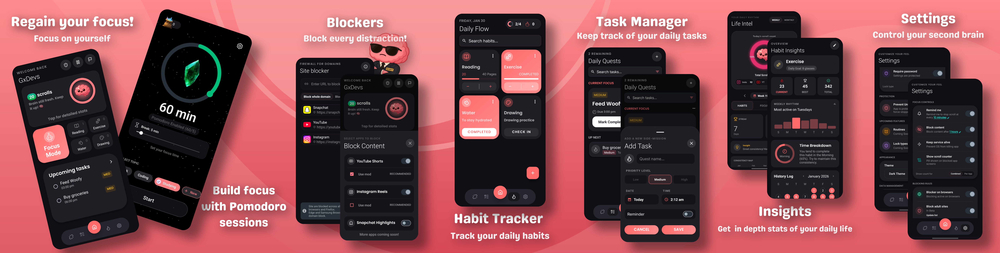
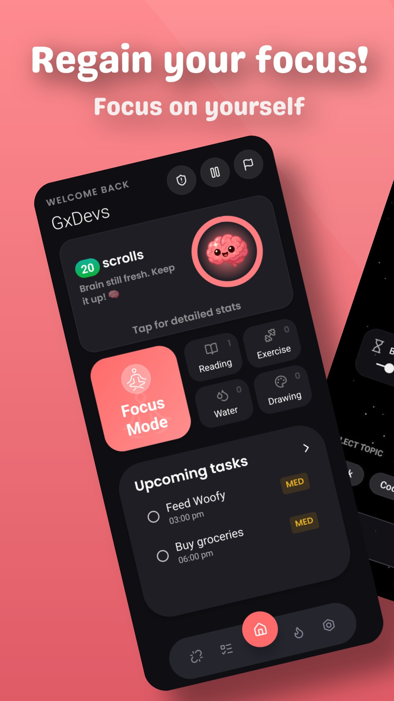
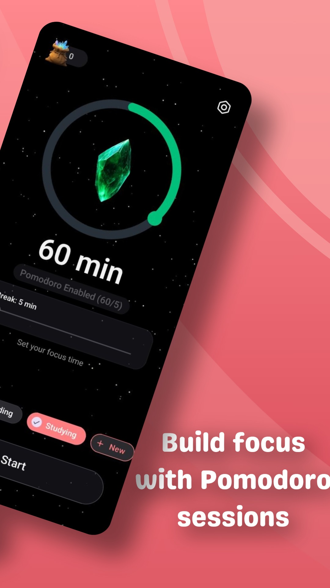
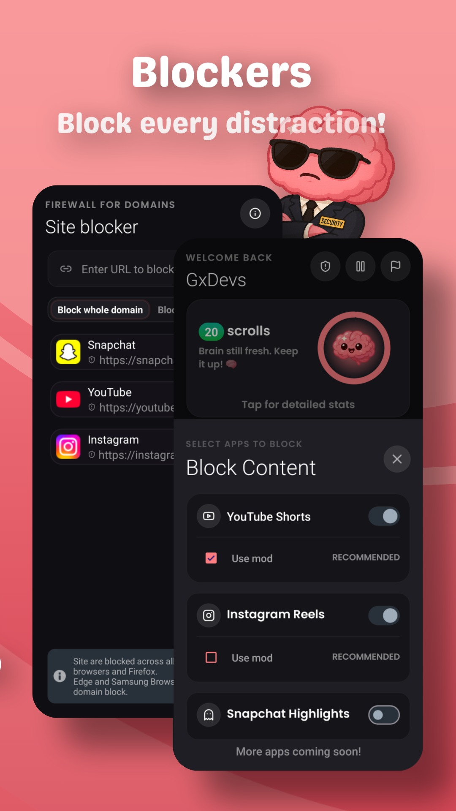
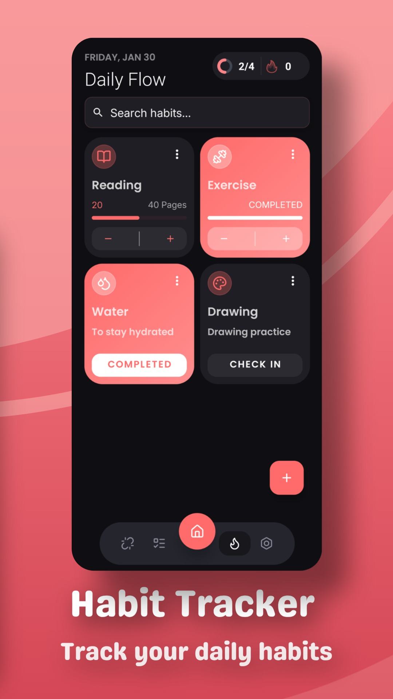
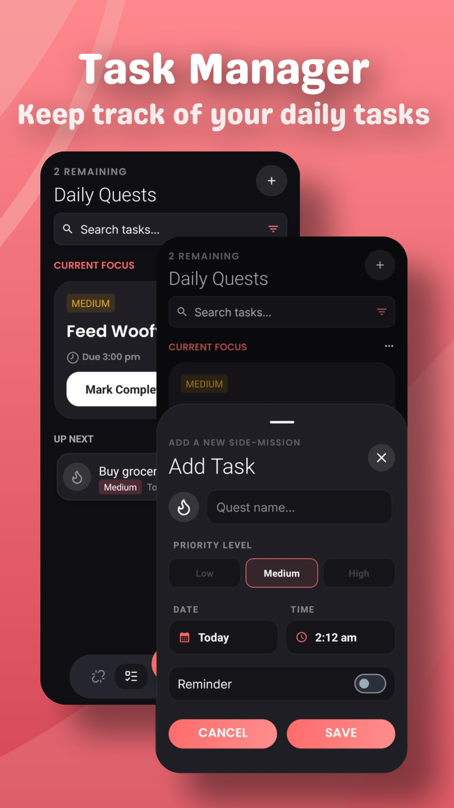
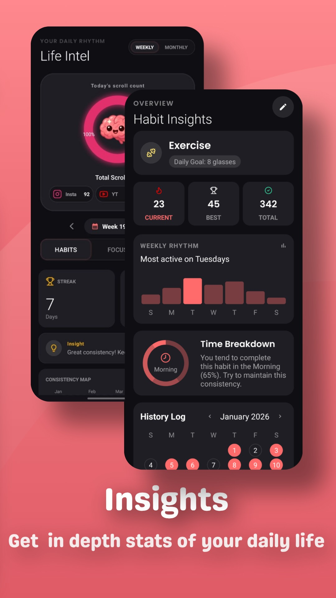
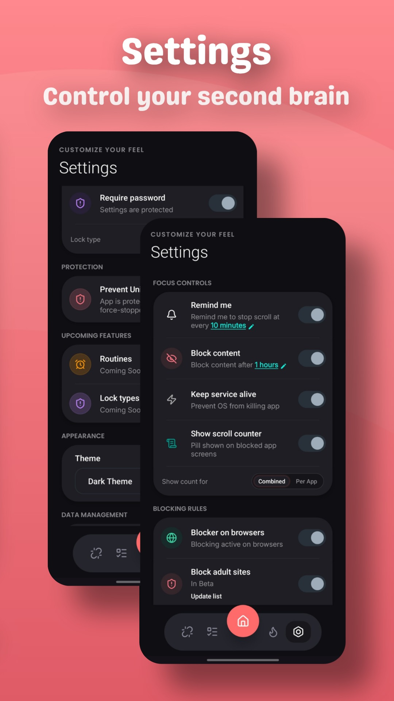

<div align="center">

  

# Mind Mint

**Reclaim Your Focus. Master Your Time.**

  <p>
    <a href="https://github.com/gtxPrime/Mind-Mint/stargazers">
      
    </a>
    <a href="https://github.com/gtxPrime/Mind-Mint/network/members">
      
    </a>
    <a href="https://github.com/gtxPrime/Mind-Mint/issues">
      
    </a>
    <a href="https://github.com/gtxPrime/Mind-Mint/blob/main/LICENSE">
      
    </a>
    <a href="#">
      
    </a>
    <a href="https://play.google.com/store/apps/details?id=com.gxdevs.mindmint">
      
    </a>
  </p>

  <h3>
    <a href="#-features">Features</a>
    <span> | </span>
    <a href="#-screenshots">Screenshots</a>
    <span> | </span>
    <a href="#-tech-stack">Tech Stack</a>
    <span> | </span>
    <a href="#-installation">Installation</a>
    <span> | </span>
    <a href="#-contributing">Contributing</a>
  </h3>

</div>

---

## 📱 About Mind Mint

**Mind Mint** is a comprehensive productivity ecosystem that helps you break free from the doomscrolling cycle. It combines a robust app blocker, an immersive focus timer, a habit tracker, and a task manager, all tied together with gamification and deep analytics to make staying focused genuinely rewarding.

> "Productivity is not about doing more. It's about doing what matters."

---

## <a id="-features"></a>🚀 Features

### 🧘 Immersive Focus Mode

Transform your work sessions into a visual journey.

- **Crystal Progression:** Watch your Focus Crystal grow and evolve across rarity tiers (Ruby, Emerald, Amethyst, and more) as you accumulate deep work time.
- **Pomodoro Timer:** Built-in Pomodoro support with configurable work and break intervals, plus an optional auto-start break switch.
- **Nebula Ambience:** A calming animated starfield eases you into a flow state.
- **Session Tagging:** Tag sessions by topic (Study, Work, Reading, etc.) to understand where your time actually goes.
- **Task-Linked Focus:** Attach a focus session directly to a specific task for end-to-end accountability.
- **Scheduled Sessions:** Plan focus blocks in advance with 12-hour time format support.
- **Dedicated Settings:** A focused settings sheet to tune every aspect of your focus experience.

### 🔒 Lock-In Mode

A hardened, distraction-proof session mode for when you need maximum discipline.

- **Strict App Blocking:** Accessibility-service-powered blocking that intercepts and redirects distracting apps the moment they are opened.
- **Browser Blocking:** Blocks distracting content directly inside mobile browsers, not just app launchers.
- **Adult Content Filter:** Keyword-aware host-level blocking for adult content across all browsers.
- **Whitelist Support:** Configure a per-session whitelist so permitted apps (e.g. navigation, calls) stay accessible even during Lock-In.
- **Robust Re-Entry Guard:** Intelligent debounce and suppression logic prevents the blocker from misfiring on OS-generated background events.
- **Overlay Shield:** A firm but non-intrusive overlay prevents bypassing the blocker without ending your session.

### 🛡️ Prevent Uninstall

Stop anyone from deleting Mind Mint without your explicit permission.

- **Device Admin Guard:** Activates Android's Device Administrator to block unauthorized uninstall attempts.
- **Settings Lock:** Secure your app settings with Biometric Authentication or a PIN so your configuration cannot be tampered with mid-session.

### 📵 Intelligent App Blocker

Stop doomscrolling before it starts, outside of focus sessions too.

- **Selective Blocking:** Block specific apps (Instagram, YouTube Shorts, TikTok, etc.) on a per-app basis.
- **Usage Limits:** Set daily time allowances per app. Once the limit is hit, the app locks for the rest of the day.
- **Live Scroll Counter:** A real-time overlay counts how much you scroll, surfacing the behavior so you can change it.
- **Pause Blocker:** Temporarily suspend blocking for a defined grace period without fully disabling the service.

### ✅ Integrated Task Manager

- **Quick Add:** Capture tasks instantly from the home screen without navigating away.
- **Priority & Due Dates:** Organize to-dos with due dates and priority levels.
- **Focus Integration:** Link any task to a focus session so completion feels concrete.
- **Widget Support:** View and check off tasks directly from your Android home screen.

### 📅 Habit Tracker

Build lasting routines with deep insight into your behavior.

- **Streak System:** Daily streaks with visual feedback keep your consistency front and center.
- **Goal Setting:** Define targets for each habit and track progress toward them.
- **Mood & Emotion Logging:** Attach how you felt to each habit entry for richer self-reflection.
- **Per-Habit Stats:** Tap any habit to open its dedicated statistics view.

### 📊 Deep Analytics

Understand your patterns with data, not guesswork.

- **Habit Heatmaps:** GitHub-style activity heatmaps visualize your consistency across the year at a glance.
- **Focus Charts:** Bar and pie charts break down focus time by topic, session length, and time of day.
- **Task Analytics:** Completion rates, overdue trends, and priority breakdowns in one view.
- **Insights:** Weekly summaries highlighting your most productive days and biggest distractions.

### 💰 Gamification & Rewards

Make productivity motivating.

- **Mint Crystals:** Earn in-app currency for every minute of successful focus time.
- **Custom Themes:** Unlock and switch between curated visual themes.
- **Shop** *(Coming Soon)*: Spend Mint Crystals on new crystal styles, themes, and companions.

### 📱 App Experience

- **Swipe Navigation:** Fluid swipe gestures for seamless screen transitions.
- **Home Screen Widgets:** 5 widgets covering focus, tasks, and habits for at-a-glance access.
- **Subtle Animations:** Micro-animations throughout the UI make interactions feel polished and alive.
- **Push Notifications:** Firebase Cloud Messaging with deep-link routing keeps you in the loop.
- **Keep Service Alive:** Optional setting to ensure the blocking service stays running in the background.

---

## <a id="-screenshots"></a>📸 Screenshots

<div align="center">
  
</div>

<br/>

<div align="center">
<table>
  <tr>
    <td></td>
    <td></td>
    <td></td>
    <td></td>
    <td></td>
    <td></td>
    <td></td>
  </tr>
</table>
</div>

---

## <a id="-tech-stack"></a>🛠 Tech Stack

Mind Mint is built with modern Android development practices for a smooth, responsive experience.

<div align="center">

| Category | Technologies |
| :--- | :--- |
| **Languages** |    |
| **Architecture** | **MVVM** (Model-View-ViewModel) |
| **Database** | **Room** (SQLite ORM) |
| **Networking** | **OkHttp**, **Glide** (Image Loading) |
| **UI Components** | **Material Design 3**, **MPAndroidChart**, **Lottie** |
| **System APIs** | **AccessibilityService**, **DevicePolicyManager**, **WorkManager** |
| **Backend / Services** | **Firebase** (Crashlytics, FCM) |
| **Tools** | **Gradle**, **Android Studio** |

</div>

<details>
<summary>Full dependency list</summary>

- `androidx.core:core-ktx`
- `androidx.appcompat:appcompat`
- `com.google.android.material:material`
- `com.github.PhilJay:MPAndroidChart`
- `com.airbnb.android:lottie`
- `com.github.skydoves:balloon`
- `com.github.bumptech.glide:glide`
- `androidx.room:room-runtime`
- `me.tankery.lib:circularSeekBar`
- And more, see `build.gradle`

</details>

---

## 📈 Repository Stats

<div align="center">

| **Commit Activity** | **Repo Size** |
| :---: | :---: |
|  |  |

| **Top Language** | **Code Size** |
| :---: | :---: |
|  |  |

</div>

---

## 🌟 Star History

<a href="https://star-history.com/#gtxPrime/Mind-Mint&Date">
  
</a>

---

## 🗺 Roadmap

- [ ] **Lock Types** - More ways to protect your settings and enforce your commitments.
- [ ] **Companions** - Friendly AI-driven companions to motivate and coach you.
- [ ] **Friendly Battles** - Challenge friends to focus streaks and see who lasts longer.
- [ ] **Cloud Sync** - Back up your data and restore it across devices.
- [ ] **Web Dashboard** - Review your full stats on a desktop browser.

---

## 📚 Documentation

- **[⚡ Quick Start](docs/QUICK_START.md)** - Get the app running in 5 minutes.
- **[🔧 Build & Run](docs/BUILD_AND_RUN.md)** - Detailed setup instructions.
- **[🏛️ Architecture](docs/ARCHITECTURE.md)** - High-level overview of the code structure.
- **[🔑 Key Components](docs/KEY_COMPONENTS.md)** - Deep dive into critical files and services.
- **[📂 Documentation Index](docs/SUMMARY.md)** - Full list of available docs.

---

## <a id="-installation"></a>📥 Installation

Mind Mint is currently in active development. Build it from source:

1. **Clone the repository**
   ```bash
   git clone https://github.com/gtxprime/mind-mint.git
   ```
2. **Open in Android Studio**
3. **Copy the example properties file** and fill in your keys
   ```bash
   cp gradle.properties.example gradle.properties
   ```
4. **Sync Gradle** and hit **Run**

> A release APK will be available in the [Releases](https://github.com/gtxPrime/Mind-Mint/releases) section soon.

---

## <a id="-contributing"></a>🤝 How to Contribute

Contributions are welcome, whether it's a bug fix, a new feature, or a documentation improvement.

1. **Fork the Project**
2. **Create your Feature Branch** (`git checkout -b feature/AmazingFeature`)
3. **Commit your Changes** (`git commit -m 'Add some AmazingFeature'`)
4. **Push to the Branch** (`git push origin feature/AmazingFeature`)
5. **Open a Pull Request**

> Current focus areas: UI animations (Lottie), widget improvements, and the upcoming Lock Types system.

---

## ⚖️ License

Distributed under a **Modified MIT License**. Visible credit to Mind Mint is required.

See [`LICENSE`](./LICENSE) for full details.

---

<div align="center">
  <b>Built with ❤️ by the Mind Mint Team</b><br/>
  <a href="https://github.com/gtxprime">GitHub</a> •
  <a href="mailto:contact@mindmint.app">Contact</a>
</div>
