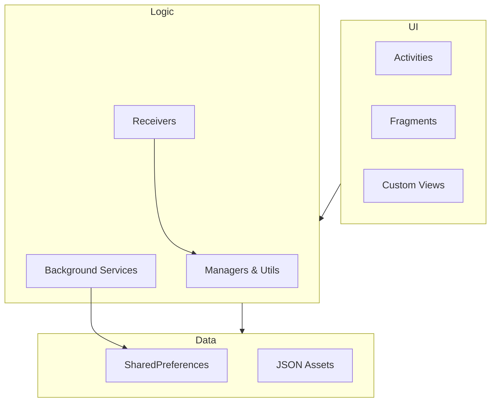

# 🏛️ Mind Mint Architecture & Code Structure

Welcome to the architectural deep dive of **Mind Mint**. This document outlines how the codebase is structured, the design patterns used, and how data flows through the application.

---

## 🏗️ Architecture Overview

Mind Mint follows a **Standard Android Architecture** pattern, utilizing Activities for UI and Services for background processing. While it leans towards a monolithic structure typical of robust utility apps, it organizes logic clearly into distinct layers.



---

## 📁 Directory Structure Explained

The core logic resides in `app/src/main/java/com/gxdevs/mindmint/`.

### 📱 Activities (UI Screens)

Each Activity represents a full screen in the app.

| File                    | Purpose            | Key Features                                                 |
| :---------------------- | :----------------- | :----------------------------------------------------------- |
| `HomeActivity.java`     | **Main Dashboard** | Navigation hub, stats display, entry point.                  |
| `FocusMode.java`        | **Focus Session**  | Countdown timer, "Mint Crystal" earning logic, immersive UI. |
| `BlockingOverlay...`    | **The Shield**     | The overlay that blocks access to distractions.              |
| `CustomAppSelection...` | **Blocklist**      | UI for selecting which apps to block.                        |
| `HabitActivity.java`    | **Habit Tracker**  | Dashboard for tracking daily habits and streaks.             |
| `TaskActivity.java`     | **Task Manager**   | Simple To-Do list management.                                |
| `OnBoarding.java`       | **Intro**          | First-time setup and permission requests.                    |

### 🔧 Services (Background Processes)

The engines running behind the scenes.

| Service                        | Type                   | Criticality     | Deep Dive                                                                                                                                                                                                                                                                                                                                                                       |
| :----------------------------- | :--------------------- | :-------------- | :------------------------------------------------------------------------------------------------------------------------------------------------------------------------------------------------------------------------------------------------------------------------------------------------------------------------------------------------------------------------------ |
| `AppUsageAccessibilityService` | `AccessibilityService` | 🔴 **CRITICAL** | **The All-Seeing Eye.** <br> • **Blocking**: Checks `custom_blocked_apps_set` pref on every window change.<br> • **Scroll Counting**: Tracks "Doom Scrolling" on Insta, YT, Snap via `AccessibilityEvent.TYPE_VIEW_SCROLLED`.<br> • **Wasted Time**: Aggregates usage time for global daily limits.<br> • **Anti-Uninstall**: Uses `isKeepAlive` to warn uses before disabling. |
| `FocusService`                 | `Service`              | 🟡 **HIGH**     | **The Focus Engine.** <br> • **State Machine**: Manages states (Running, Paused, Break) via `FocusStateEntity`.<br> • **Persistence**: Saves state to Room DB to survive app kills.<br> • **Pomodoro**: Handles automatic transitions between Focus and Break intervals.                                                                                                        |

### 🧰 Utils & Managers (Business Logic)

Helper classes that handle data processing and logic.

- **`MintCrystals.java`**: Manages the in-app currency economy.
- **`TaskManager.java`**: Handles CRUD operations for user tasks (saved via JSON/Prefs).
- **`HabitManager.java`**: Manages habit data, streaks, and completion history.
- **`MidnightResetReceiver`**: A broadcast receiver that triggers daily resets (streaks, daily limits) at 12:00 AM.

---

## 🔄 Data Flow Examples

### 1. Blocking an App

1.  **User** opens a distracting app (e.g., Instagram).
2.  **`AppUsageAccessibilityService`** detects the package name change.
3.  **Check**: Services queries `SharedPreferences` to see if this package is in the blocklist.
4.  **Action**: If blocked, it immediately launches `BlockingOverlayDisplayActivity` over the top.
5.  **Result**: Access is denied.

### 2. Earning Mint Crystals (Focus Mode)

1.  **User** starts a session in `FocusMode.java`.
2.  **Service**: `FocusService` starts a foreground timer.
3.  **Update**: On every tick, it broadcasts updates to the UI (for the progress bar/Visuals).
4.  **Completion**: When time is up, `FocusService` calculates reward.
5.  **Reward**: Calls `MintCrystals.add(amount)` to update the balance in `SharedPreferences`.

---

## 🧩 Key Design Patterns

### 1. Singleton Pattern

Used heavily in Managers to ensure a single source of truth for data.

```java
public class HabitManager {
    private static HabitManager instance;
    public static synchronized HabitManager getInstance(Context context) { ... }
}
```

### 2. Adapter Pattern

Used in `RecyclerViews` to bind data lists to UI elements (e.g., `HabitAdapter`, `TaskAdapter`).

---

## 💾 Data Layer Deep Dive

Mind Mint uses a hybrid approach: **Room Database** for structured data and **SharedPreferences** for lightweight config.

### 🗄️ Room Database (`MindMintRoomDatabase`)

The app uses a robust SQL database for complex data. Key Entities:

| Entity Table            | Purpose                                                       |
| :---------------------- | :------------------------------------------------------------ |
| `FocusSessionEntity`    | History of every focus session (duration, topic, timestamp).  |
| `FocusStateEntity`      | _Current_ running state of the timer (allows crash recovery). |
| `HabitEntity`           | Definitions of user habits (frequency, name, reminder time).  |
| `HabitCompletionEntity` | Logs every successful habit completion date.                  |
| `DailyStatsEntity`      | Aggregated daily app usage stats.                             |
| `AppUsageStatsEntity`   | Raw usage logs for specific apps.                             |
| `TaskEntity`            | User's To-Do list items.                                      |

### ⚡ SharedPreferences (`AppData`)

Used for high-frequency, low-latency lookups:

- **Blocklist**: `custom_blocked_apps_set` (Set<String>) - Fast O(1) lookup during UI events.
- **Economy**: `mint_crystals_balance` - Current user currency.
- **Settings**: `pref_block_after_wasted_time_hours`, `pref_remind_doom_scrolling_minutes`.

---

## 🔐 Security & Permissions

- **Accessibility Permission**: Required for the Blocker to function. The app only reads package names to check against your blocklist; it does **not** read content or passwords.
- **Overlay Permission**: Required to draw the "Block Screen" over other apps.

---

_This architecture allows Mind Mint to be responsive and battery-efficient while maintaining the strict control needed for an app blocker._
